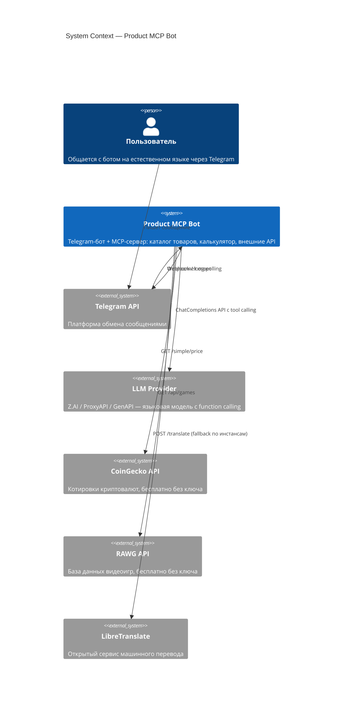
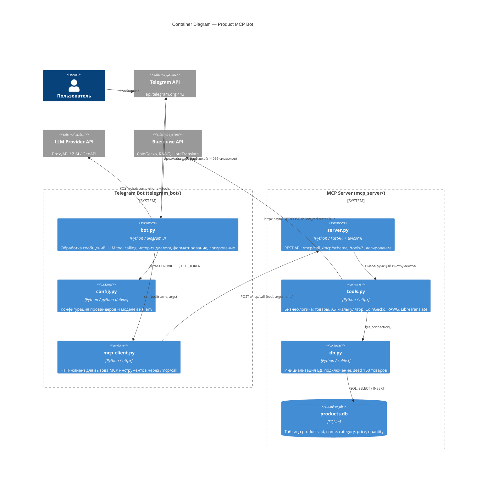
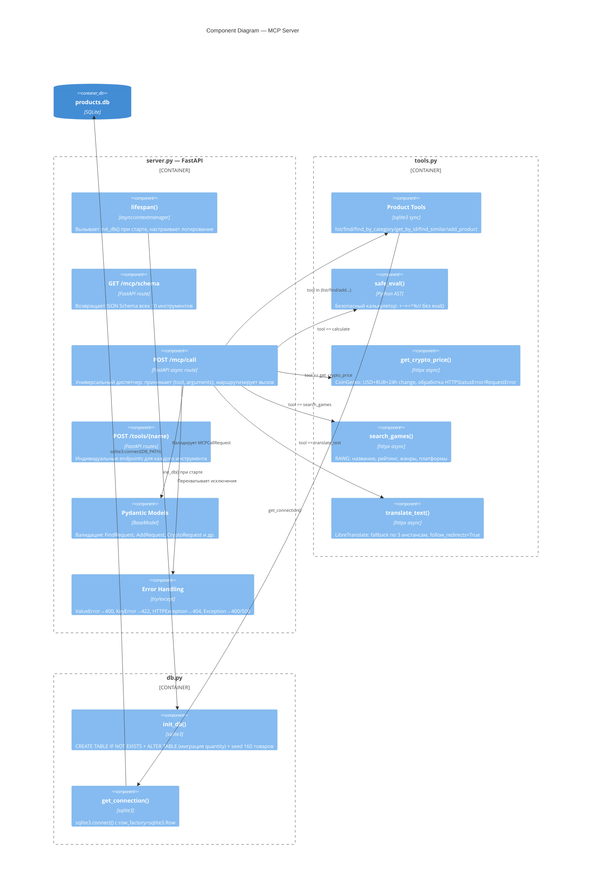
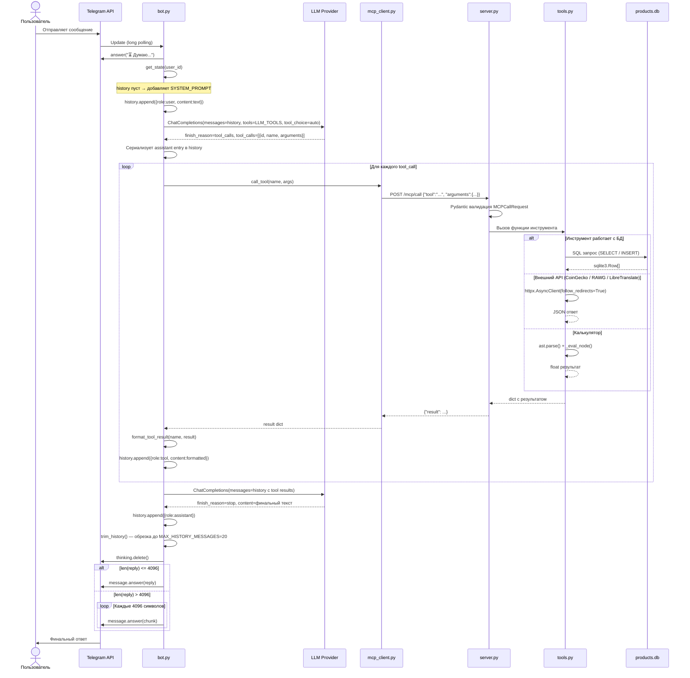
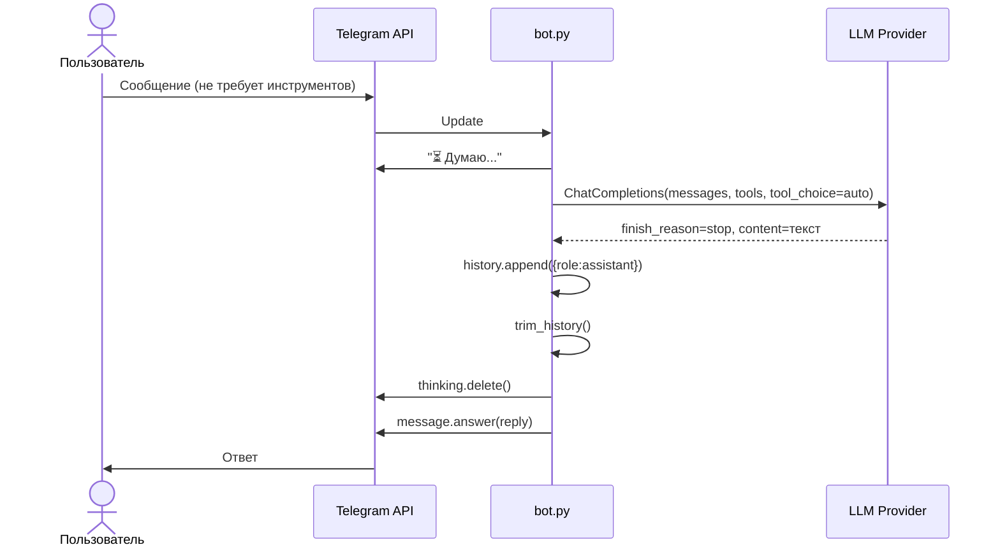
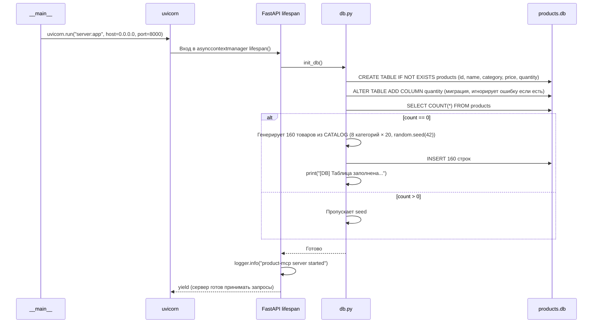
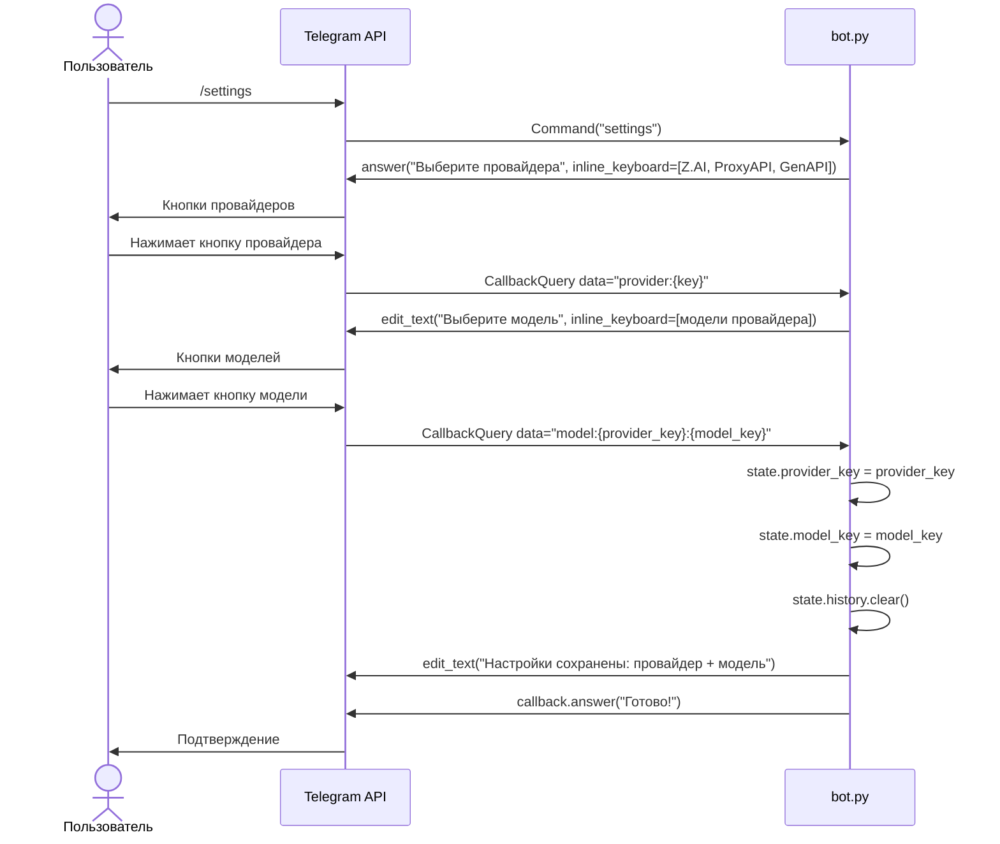
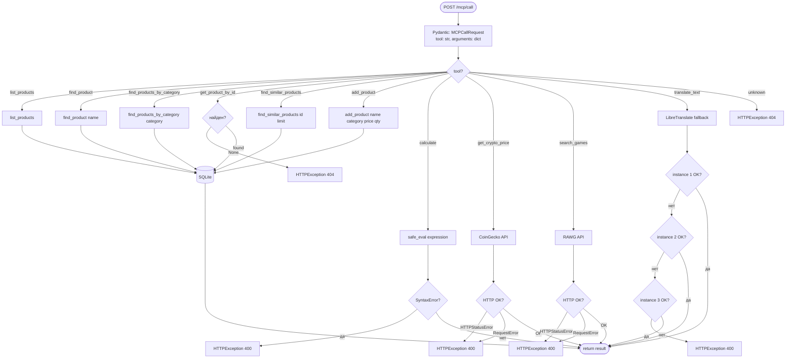
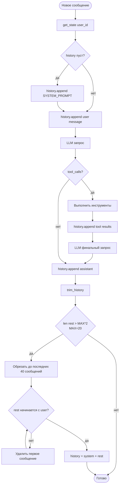
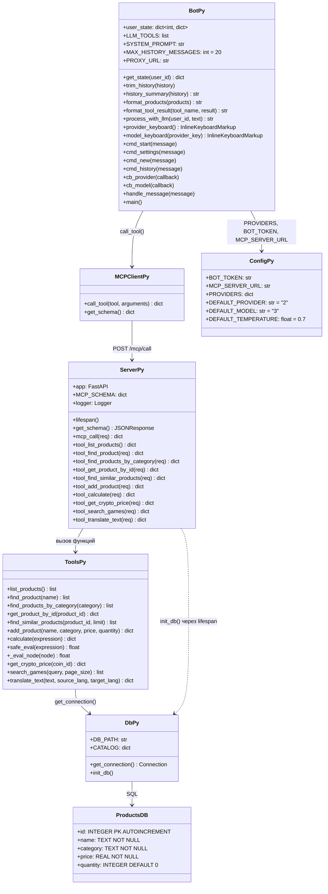

# Product MCP Bot


## Описание

**Product MCP Bot** — учебный MCP-проект: магазин товаров с Telegram-ботом на базе LLM.

Предметная область — каталог товаров интернет-магазина. Пользователь общается с ботом на естественном языке: ищет товары, добавляет новые, получает курсы криптовалют, ищет игры и переводит текст. Бот использует LLM с function calling для определения нужного инструмента и обращается к MCP-серверу по HTTP.

Компоненты:
- `mcp_server/` — MCP-совместимый сервер (FastAPI + SQLite): инструменты для работы с товарами, калькулятор, интеграции с внешними API
- `telegram_bot/` — Telegram-бот (aiogram 3 + OpenAI-compatible API): системный промпт, история диалога, форматирование ответов

Расширения относительно базового product-mcp:
- инструменты `get_product_by_id`, `find_similar_products`
- внешние API: CoinGecko (крипта), RAWG (игры), LibreTranslate (перевод)
- поддержка 3 AI-провайдеров с выбором модели через `/settings`
- история диалога с автоматической обрезкой (до 20 пар сообщений)
- разбивка длинных ответов на части (лимит Telegram 4096 символов)
- логирование в файл (`bot.log`, `server.log`)
- поддержка прокси для регионов с блокировкой Telegram

---

## Архитектура (C4)

### Уровень 1 — System Context



### Уровень 2 — Container



### Уровень 3 — Component (MCP Server)



---

## Процессы и взаимодействия (UML)

### Sequence — Полный цикл обработки сообщения с tool calling



### Sequence — Ответ без tool calling



### Sequence — Инициализация сервера



### Sequence — Выбор провайдера и модели (/settings)



### Activity — Диспетчеризация в /mcp/call



### Activity — Управление историей диалога



### Class — Структура модулей



---

## Структура проекта

```
.env                        # Переменные окружения
README.md                   # Документация
mcp_server/
├── server.py               # FastAPI MCP сервер, логирование → server.log
├── db.py                   # SQLite: инициализация, seed, подключение
├── tools.py                # Инструменты: товары, калькулятор, внешние API
├── products.db             # Создаётся автоматически при первом запуске
├── server.log              # Лог сервера
└── requirements.txt
telegram_bot/
├── bot.py                  # Логика бота, LLM tool calling, история, логирование → bot.log
├── config.py               # Конфигурация провайдеров из .env
├── mcp_client.py           # HTTP-клиент для /mcp/call
├── bot.log                 # Лог бота
└── requirements.txt
```

---

## Установка и запуск

### 1. Создать и активировать venv

```bash
python -m venv venv
venv\Scripts\activate
```

### 2. Установить зависимости

```bash
pip install -r mcp_server/requirements.txt
pip install -r telegram_bot/requirements.txt
```

### 3. Запустить MCP сервер (Терминал 1)

```bash
cd mcp_server
python .\server.py
```

Сервер запустится на `http://localhost:8000`.
При первом запуске создаётся `products.db` с 160 товарами по 8 категориям.
Лог пишется в `mcp_server/server.log`.

### 4. Запустить Telegram-бота (Терминал 2)

```bash
cd telegram_bot
python .\bot.py
```

Лог пишется в `telegram_bot/bot.log`.

### Прокси (если Telegram недоступен)

Раскомментировать в `.env`:
```env
TELEGRAM_PROXY_URL=socks5://127.0.0.1:1080
```
Установить: `pip install aiohttp-socks`

---

## База данных

Таблица `products`:

| Колонка  | Тип     | Описание             |
|----------|---------|----------------------|
| id       | INTEGER | Первичный ключ       |
| name     | TEXT    | Название товара      |
| category | TEXT    | Категория            |
| price    | REAL    | Цена (±10% от базы)  |
| quantity | INTEGER | Количество на складе |

Категории (8 шт., по 20 товаров): Электроника, Одежда, Продукты, Книги, Спорт, Дом, Игрушки, Косметика.

---

## MCP инструменты

Универсальный endpoint: `POST /mcp/call` с телом `{"tool": "...", "arguments": {...}}`

### Товары

| Инструмент                  | Параметры                                    | Описание                                        |
|-----------------------------|----------------------------------------------|-------------------------------------------------|
| `list_products`             | —                                            | Все товары (показывает первые 30 из 160)        |
| `find_product`              | `name: string`                               | Поиск по названию (LIKE %name%)                 |
| `find_products_by_category` | `category: string`                           | Поиск по категории (LIKE %category%)            |
| `get_product_by_id`         | `product_id: integer`                        | Товар по точному ID, 404 если не найден         |
| `find_similar_products`     | `product_id: integer`, `limit: integer (=5)` | Похожие из той же категории, сортировка по цене |
| `add_product`               | `name`, `category`, `price`, `quantity (=0)` | Добавить товар                                  |

### Утилиты

| Инструмент         | Параметры                                          | Описание                                                      |
|--------------------|----------------------------------------------------|---------------------------------------------------------------|
| `calculate`        | `expression: string`                               | AST-калькулятор без eval(). Операции: +−×÷**%//               |
| `get_crypto_price` | `coin_id: string`                                  | CoinGecko: цена в USD и RUB + изменение за 24ч                |
| `search_games`     | `query: string`, `page_size: integer (=5)`         | RAWG: название, дата, рейтинг, жанры, платформы               |
| `translate_text`   | `text`, `source_lang (=auto)`, `target_lang (=ru)` | LibreTranslate: fallback по 3 инстансам, follow_redirects=True |

---

## Telegram-бот

### Команды

| Команда     | Описание                                          |
|-------------|---------------------------------------------------|
| `/start`    | Приветствие, текущий провайдер/модель/температура |
| `/settings` | Выбор AI-провайдера и модели (inline keyboard)    |
| `/new`      | Очистить историю диалога                          |
| `/history`  | Показать последние 10 сообщений из истории        |

### AI-провайдеры

| # | Провайдер         | Переменная в .env | Модели                                                        |
|---|-------------------|-------------------|---------------------------------------------------------------|
| 1 | Z.AI              | `ZAI_API_KEY`     | GLM-4.7-Flash, GLM-4.5-Flash, GLM-4.7                        |
| 2 | ProxyAPI (OpenAI) | `PROXY_API_KEY`   | GPT-4.1 Nano, GPT-4.1 Mini, GPT-4o Mini, GPT-4o              |
| 3 | GenAPI            | `GEN_API_KEY`     | GPT-4.1 Mini, GPT-4o, Claude Sonnet 4.5, Gemini 2.5 Flash, DeepSeek Chat |

По умолчанию: ProxyAPI + GPT-4o Mini (температура 0.7).

### Примеры запросов

```
покажи все товары
найди чай
товары категории электроника
товар с ID 5
похожие на товар 5
добавь товар яблоки фрукты 120 50 штук
сколько будет 15 * 8 + 42
курс биткоина
найди игру witcher
переведи hello на русский
```

---

## Переменные окружения (.env)

```env
BOT_TOKEN=...                    # Telegram Bot Token
TELEGRAM_PROXY_URL=...           # Опционально: socks5://... или http://...
ZAI_API_KEY=...                  # Z.AI API Key
PROXY_API_KEY=...                # ProxyAPI Key
GEN_API_KEY=...                  # GenAPI Key
MCP_SERVER_URL=http://localhost:8000
```
